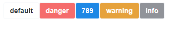

## QuickStart

### Global Import

```
// main.ts
import { createApp } from 'vue'
import DgUi from 'dg-desing-vue'
import 'dg-design-vue/dist/style.css'
import App from './App.vue'

const app = createApp(App)

app.use(DgUi)
app.mount('#app')
```

### Usage in components

```vue
<template>
  <div>
    <div>
      <dg-button>dg-ui</dg-button>
      <dg-button type="primary"></dg-button>
      <dg-button type="success"></dg-button>
      <dg-button type="warning"></dg-button>
      <dg-button type="danger"></dg-button>
      <dg-button type="info"></dg-button>
    </div>
  </div>
</template>
```

### Result


