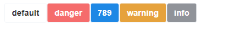

## 快速开始

### 全局引入

```
// main.ts
import { createApp } from 'vue'
import DgUi from '@dyggod/dg-ui'
import '@dyggod/dg-ui/dg-ui/dist/style.css'
import App from './App.vue'

const app = createApp(App)

app.use(DgUi)
app.mount('#app')
```

#### 在组件中使用

```vue
<template>
  <div>
    <div>
    <dg-button>dg-ui</dg-button>
    <dg-button type="primary"></dg-button>
    <dg-button type="success"></dg-button>
    <dg-button type="warning"></dg-button>
    <dg-button type="danger"></dg-button>
    <dg-button type="info"></dg-button>
  </div>
  </div>
</template>
```

#### 效果


